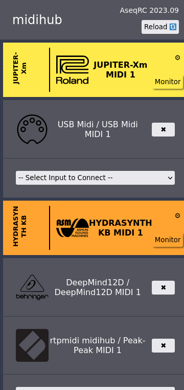
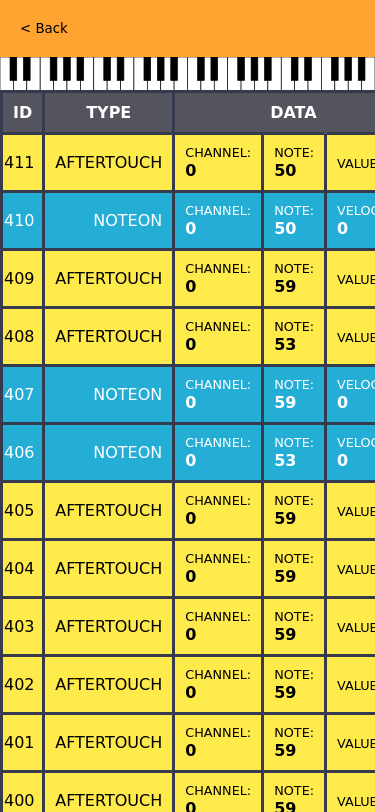

# Alsa Sequencer Remote Control

Creates an http server that aallows to easily control alsa sequencer
connections.

I use it to connect all my MIDI gear to a Raspberry Pi, and control the
connections with my mobile.

Very handily it is packaged as a PWA, so it can be installed as an app from
the browser.

After installation it is available at http://IP:5000 and can be installed as a PWA.




# Use

The patch screen shows the outputs, and you can add to which input it
is connected from the selector. Connections can be removed pressing
the x.

There is a `Monitor` button for each output that allows midi
monitoring for wasy troubleshooting.

All connections are remembered and if a device dissapears (unplugged
for example), when it reappears its reconnected. Same happens after
reboots.

My normal use case is always running in a raspberry pi, and all my
MIDI gadgets connected.

# Install

There are periodic releases at (github releases)[https://github.com/davidmoreno/aseqrc/releases]

Download latest, and install:

```
sudo dpkg -i aseqrc-latest_all.deb
```

There might be pending dependencies, which can be installed with:

```
sudo apt -f install
```

To start it run:

```sh
sudo service aseqrc start
```

To stop:

```sh
sudo service aseqrc stop
```

To always run

```sh
sudo systemctl enable aseqrc
```

To stop always run:

```sh
sudo systemctl disable aseqrc
```

# Compile and Install

It has been developed and tested on Ubuntu 20.04. Older versions may need more work.

1. Install all required deps (open an issue if any missing):

```sh
apt install nodejs yarnpkg dh-make fakeroot
```

2. Create the deb package

```sh
make deb
```

The .deb file is created at the parent directory.
